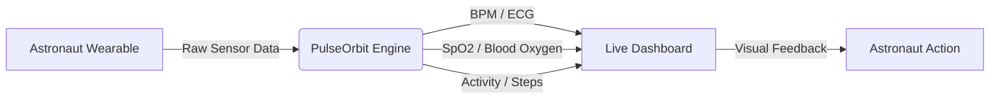

# PULSEORBIT 

> **The definitive truth of your own biology in deep space.**

**NASA Space Apps Challenge 2026:** Create Health Monitoring Software for Astronauts on Space Missions

---

## The Problem
Long-duration space missions expose astronauts to extreme conditions like radiation, altered gravity, and isolation. To survive and thrive in these hostile, closed environments, astronauts need a way to autonomously monitor, evaluate, and act upon critical changes in their own physiological health without relying solely on delayed communications with Mission Control on Earth.

## Our Solution
**PulseOrbit** is a premium, localized health-monitoring interface designed specifically for astronaut wearables. It translates complex biological telemetry into an immersive, immediately readable dashboard, empowering crew members to monitor their vital signs and mission readiness in real-time.

## Key Features
* **Continuous ECG (BPM):** Real-time pulse tracking simulating medical-grade optical sensor data.
* **Atmosphere Adaptation (SpO₂):** Continuous blood oxygenation monitoring, crucial for detecting environmental changes in the suit or habitat.
* **Mission Progress (Steps & Activity):** 6-axis gyroscope tracking to map physical expenditure and daily terrain mapping goals.
* **Immersive Visualizations:** High-performance, scroll-driven GSAP interface with live tabular data updates designed to reduce cognitive load during high-stress operations.

## Why It Matters in Space
In deep space or on planetary surfaces, a communication delay with Earth can last up to 20 minutes each way. Astronauts cannot afford to wait for medical officers to interpret their data during an emergency. PulseOrbit puts autonomous health evaluation directly on the astronaut's wrist, transforming raw telemetry into actionable, glanceable insights to ensure immediate mission safety.

## How It Works

## NASA Challenge Alignment

| NASA Need | Our Solution |
| :--- | :--- |
| **Gather health indicators** | Gathers and visualizes real-time BPM, SpO₂, and physical expenditure data. |
| **Evaluate health status** | Consolidates complex metrics into a glanceable UI that immediately highlights current biological baselines. |
| **Support informed action** | Provides clear progress indicators (e.g., "80% to daily goal") to help astronauts pace their physical exertion. |

## Tech Stack
* **Frontend:** React, Vite
* **Animations & Interactivity:** GSAP (ScrollTrigger) for cinematic, scroll-driven data storytelling
* **Styling:** Custom Vanilla CSS for a premium, low-overhead UI

## Future Scope
* **Live MQTT Telemetry:** Stream actual hardware telemetry data from physical wearables via a lightweight MQTT broker.
* **Predictive Health Alerts:** Implement localized machine learning to warn astronauts of irregular heart rhythms or sudden drops in oxygen before they become critical.
* **Mission Control Sync:** A background sync agent that batches health trends and sends them to Earth when communication windows open.
* **Environmental Context:** Correlate internal health data with external suit sensors (radiation, temperature) to identify environmental causes of physiological stress.

## Team
* **[Team Name / Placeholder]** 
